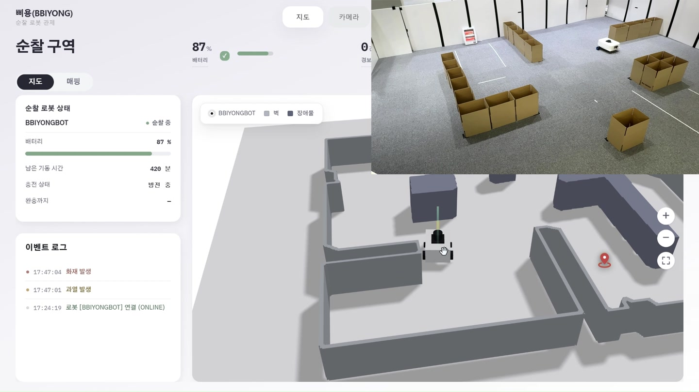
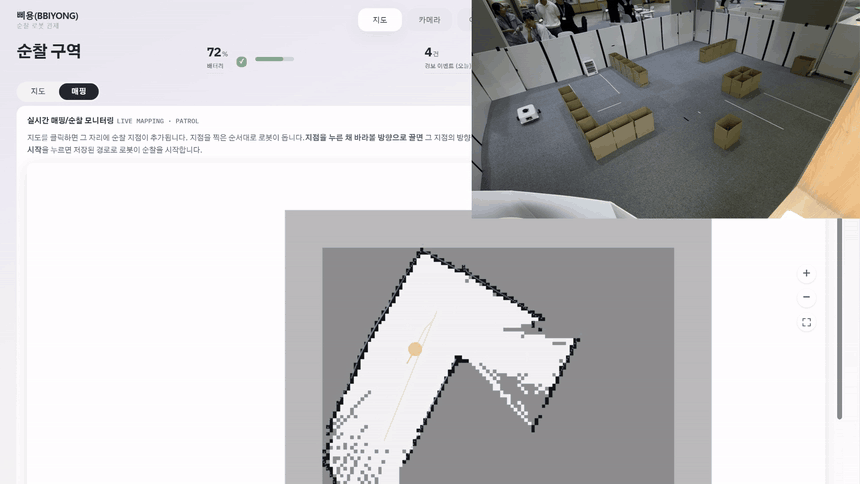
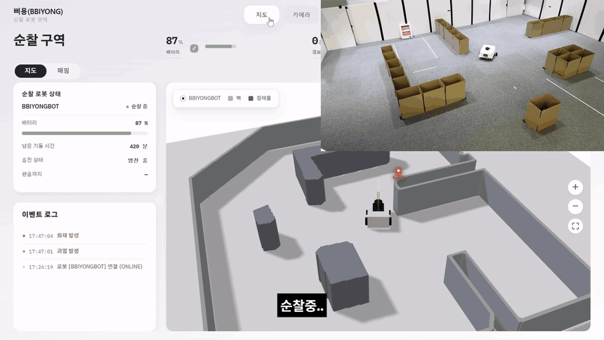
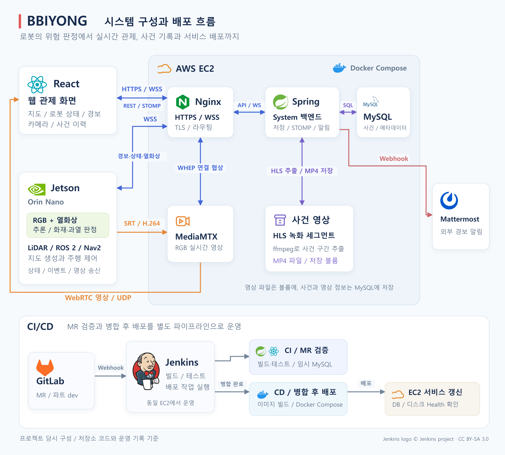

# BBIYONG · 삐용

**로봇 기반 화재·설비 모니터링 시스템**

BBIYONG은 RGB 카메라와 열화상 센서를 탑재한 로봇으로 현장의 화재와 설비 과열을 감지하고, 웹 관제 화면에서 확인하는 프로젝트입니다. 로봇의 상태와 영상을 실시간으로 확인하고, 위험 발생 시 경보, 사건 이력, 관련 영상으로 이어지는 흐름을 구현했습니다.

SSAFY 15기 공통 프로젝트

## 담당 역할

인프라와 CI/CD를 주로 담당했고, RGB와 열화상 정보를 결합한 화재 감지 로직을 구현했습니다. System 백엔드의 이벤트 저장과 알림 경로를 보완하고, 실제 센서 입력부터 관제 화면과 외부 알림까지 연결되는 흐름을 검증했습니다.

| 영역 | 직접 담당한 작업 |
| --- | --- |
| 인프라 | EC2, Nginx, Docker Compose 기반 배포 환경 구성과 MySQL 운영 |
| CI/CD | Jenkins에서 MR 빌드·테스트와 병합 후 배포 분리, 임시 MySQL 통합 테스트 환경 구성, 배포 상태와 로봇 연결 상태를 분리한 Health 검증 |
| 화재 감지 로직 | RGB 탐지 결과와 열화상 온도, 시간 연속성, 공간 일치를 결합한 화재 판정 로직 구현 및 실제 센서 입력에 맞춘 판정 조건 조정 |
| System 백엔드 보완 | `messageId` 기반 중복 이벤트 저장 방어, `eventId`로 경보·이력·영상 연결, 외부 알림의 전송 상태와 재시도 처리 |
| 실물 연동 검증 | 실제 센서의 데이터 형식과 입력 주기 확인·조정, 위험 감지 결과가 DB 저장부터 관제 화면과 외부 알림까지 전달되는 흐름 검증 |

## 관제 화면



로봇의 위치와 순찰 경로를 지도에서 확인하고, RGB·열화상 영상과 이벤트 이력을 함께 조회합니다. 아래 화면과 GIF는 프로젝트 시연 영상에서 발췌했습니다.

## 주요 기능

| 기능 | 설명 |
| --- | --- |
| 실시간 로봇 관제 | 로봇의 연결 상태, 배터리, 위치와 카메라 영상 확인 |
| 화재·과열 감지 | RGB 영상의 객체 탐지와 열화상 온도 정보를 활용한 위험 감지 |
| 지도 생성과 순찰 | LiDAR 기반 지도 생성, 순찰 지점과 경로 설정, 로봇 제어 |
| 실시간 경보와 외부 알림 | 위험 이벤트를 관제 화면에 전달하고 Mattermost 알림 전송 |
| 사건 이력과 영상 | 이벤트 목록과 상세 정보 조회, 사건에 연결된 영상 확인 |

### 지도 생성



### 위험 감지와 경보



열화상 온도 정보와 카메라 영상을 확인하고, 위험 감지 결과를 웹 경보로 전달하는 시연입니다.

## 시스템 구성

프로젝트 당시의 서비스 통신 구조입니다. 전면 RGB 영상, 열화상 프레임과 사건 녹화 영상은 각각의 전달 경로를 사용합니다.



[SVG 원본](docs/media/architecture.svg) / [로고 출처](docs/media/icons/SOURCES.md)

Jenkins 로고: [Jenkins project](https://www.jenkins.io/), CC BY-SA 3.0.

- **로봇과 AI**: RGB 추론 결과와 열화상을 결합해 위험을 판정하고, LiDAR와 ROS 2로 지도 생성과 주행 제어를 처리합니다.
- **상태와 경보**: 로봇의 WSS 메시지를 System이 받아 저장·처리하고, 브라우저에 STOMP로 전달합니다. 열화상 프레임과 검출 정보도 이 경로로 중계합니다.
- **실시간 RGB 영상**: Jetson의 H.264 영상을 SRT로 MediaMTX에 전달하고, 브라우저에서 WebRTC로 재생합니다. WHEP 연결 협상은 Nginx를 거치며 영상 데이터는 UDP로 전달됩니다.
- **사건 영상**: System이 HLS 녹화 세그먼트에서 사건 전후 구간을 추출해 MP4 파일을 저장합니다. MySQL에는 사건과 영상 메타데이터를 기록합니다.
- **인프라와 배포**: EC2, Nginx, Docker Compose와 Jenkins로 배포 환경과 빌드·검증 파이프라인을 구성했습니다.

### 이벤트 처리에서 고려한 점

- 사건을 저장한 뒤 발급된 `eventId`로 실시간 경보, 상세 조회와 영상을 연결합니다.
- 로봇 재전송에 대비해 `messageId`의 DB unique 제약으로 중복 저장을 방어합니다.
- 외부 알림의 전송 상태를 저장하고 실패한 전송을 재시도합니다.

## 기술 스택

| 영역 | 기술 |
| --- | --- |
| 프런트엔드 | React, TypeScript, Vite, Three.js, STOMP.js, hls.js |
| System 백엔드 | Java 17, Spring Boot, Spring Security, Spring Data JPA, MySQL |
| 로봇 | Jetson Orin Nano, ROS 2 Humble, Nav2, SLAM Toolbox, LiDAR, ESP32 |
| AI | Python, Ultralytics YOLO, OpenCV, ONNX, TensorRT |
| 통신·영상 | REST, WSS, STOMP, SRT, WebRTC(WHEP), HLS |
| 인프라 | AWS EC2, Nginx, Docker Compose, Jenkins |

## 저장소 구조

```text
BBIYONG/
├── FE/bbiyong-react/   # 웹 관제 화면
├── BE_system/         # 이벤트, 인증, 이력, 알림 등 System 백엔드
├── BE_robot/          # 로봇 제어, ROS 2, 센서·펌웨어 연동
├── AI/                # 모델 학습·평가와 Jetson 추론 도구
├── docs/              # API·설계 문서와 발표 자료
└── scripts/           # 개발·운영 보조 스크립트
```

## 프런트엔드 실행

Node.js와 npm이 설치된 환경에서 실행합니다.

```bash
git clone https://github.com/durian98/BBIYONG.git
cd BBIYONG/FE/bbiyong-react
npm ci
npm run dev
```

실제 데이터 조회와 로봇 제어에는 백엔드, 영상 서버와 로봇 연결이 필요합니다. AI 모델 파일, 인증 정보와 센서 설정도 실행 환경에 맞게 별도로 준비해야 합니다. 각 파트의 설정과 실행 방법은 아래 문서를 참고하세요.

## 관련 문서

- [프런트엔드 안내](FE/bbiyong-react/README.md)
- [백엔드 API 명세](docs/backend_api_specification.md)
- [로봇 하드웨어와 펌웨어](BE_robot/README.md)
- [ROS 2 지도 생성과 내비게이션](BE_robot/ros2_ws/README.md)
- [AI 학습·평가](AI/README.md)
- [Jetson 추론 배포](AI/deployment/fire_smoke/README.md)
- [초기 아키텍처와 API 설계](docs/architecture_and_api_spec.md)
- [최종 발표 자료](docs/BBIYONG_최종발표.pptx)

하위 문서에는 개발 단계의 설계와 실험 기록도 포함되어 있습니다. 장치별 실행 조건과 현재 코드가 함께 맞는지 확인하고 사용하세요.
